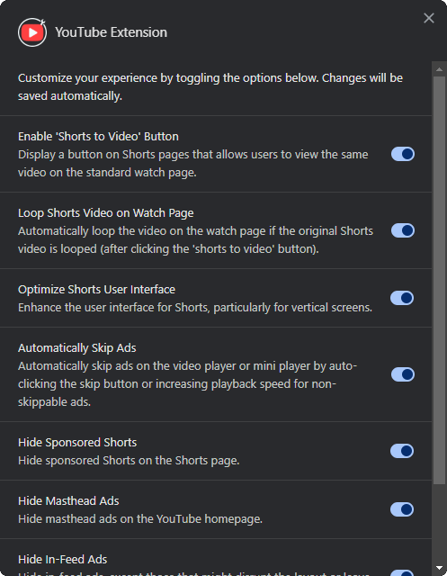

  

  [![Release][release-shield]][latest-release]
  [![Last commit][last-commit-shield]][latest-commit]
  [![License][license-shield]][license-file]

  [Changes since the last release »][latest-changes]

  [Report Bug][bug-report-template] · [Request Feature][feature-request-template]

## Features

- ***Shorts To Video* Button** - adds a button to the shorts page that allows you to watch the short as a standard video.
- **Auto Loop Video** - sets the loop property of the video after clicking the *shorts to video* button.
- **Shorts UI Tweaks** - some UI improvements for the shorts page, especially for vertical screens.
- **Auto Skip Ads** - automatically skips ads when they appear on a video.
- **Hide Sponsored Shorts** - hides sponsored shorts from the shorts page.
- **Hide Masthead Ads** - hides the *masthead ads* on the homepage.
- **Hide In-Feed Ads** - hides *in-feed ads* (except for homepage, because it would break the layout).
- **Hide Player Ads** - hides *player ads* on the watch page.

## Options

You can toggle the features on and off on the options page. To access the options page, right-click the extension icon in the browser toolbar and select `Options`. You can also left-click the icon when on the YouTube page. For other pages, the icon will open the YouTube homepage in a new tab.

  

## Installation

1. Open the latest release (e.g.: 0.1.2) and download the `youtube_extension_<VERSION>.zip`, where `<VERSION>` is the version number (e.g.: *youtube_extension_0.1.2.zip*).
2. Unzip the downloaded file to a new directory.
3. In Chrome, go to the `chrome://extensions/` page.
4. Turn on the developer mode in the top right corner.
5. Click the `Load unpacked` button and select the unzipped directory with the extension.
6. You can add the extension to the browser toolbar by clicking the `puzzle` icon in the top right corner and then clicking the `pin` icon next to the extension name.
7. Right-click the extension icon in the toolbar and select `Options` to open the options page. Enable or disable the features as you wish.

## Local development

1. Clone the repository to your local machine.
2. Set git hooks by running the `npm run prepare` command.
3. Install the dependencies using the `npm install` command.
4. Build the project using the `npm run build` command.
5. Open the Chrome browser and go to the `chrome://extensions/` page.
6. Turn on the developer mode in the top right corner.
7. Click the `Load unpacked` button and select the `dist` directory from the cloned repository.

Build the project after making changes to the source code using the `npm run build` command. Reload the extension on the `chrome://extensions/` to make sure every change is applied.

## License

GNU General Public License v3.0. See the [LICENSE](LICENSE) file for more information.

<!-- Shields -->
[release-shield]: https://img.shields.io/github/v/release/dae-ne/youtube-browser-extension
[last-commit-shield]: https://img.shields.io/github/last-commit/dae-ne/youtube-browser-extension
[license-shield]: https://img.shields.io/github/license/dae-ne/youtube-browser-extension.svg

<!-- Links -->
[latest-release]: https://github.com/dae-ne/youtube-browser-extension/releases/latest
[latest-changes]: https://github.com/dae-ne/youtube-browser-extension/compare/latest...main
[latest-commit]: https://github.com/dae-ne/youtube-browser-extension/compare/main^...main
[license-file]: LICENSE

<!-- Issue templates -->
[bug-report-template]: https://github.com/dae-ne/youtube-browser-extension/issues/new?labels=bug&template=bug_report.md
[feature-request-template]: https://github.com/dae-ne/youtube-browser-extension/issues/new?labels=enhancement&template=feature_request.md
